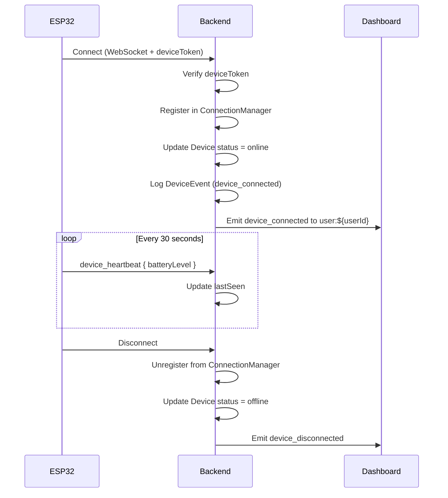
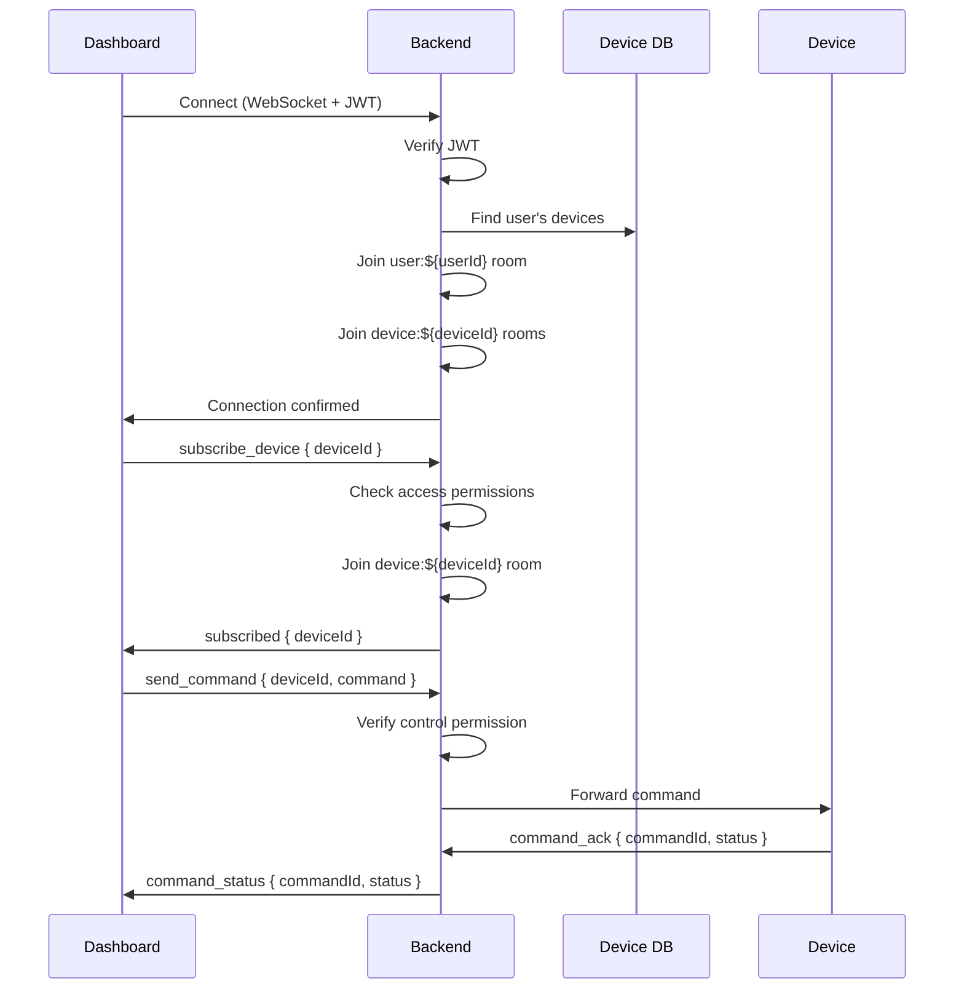
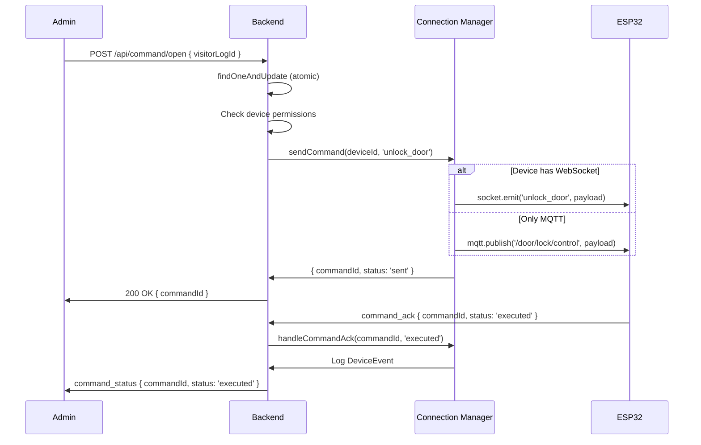

# 🔐 Production-Ready WebSocket System - Complete Implementation

## 🎯 Overview

This document describes the **complete refactoring** of the backend WebSocket system for the Smart IoT Door Lock System. The implementation now includes:

✅ **Authenticated WebSocket connections** for devices and dashboards  
✅ **Multi-tenancy support** with user ownership and device sharing  
✅ **Centralized device connection management** (WebSocket + MQTT)  
✅ **Message validation** for all events  
✅ **Command queue and acknowledgment system**  
✅ **Event sourcing for audit trails**  
✅ **Race condition prevention** with atomic operations  
✅ **Health monitoring and metrics**  
✅ **Proper error handling and reconnection logic**

---

## 📋 Table of Contents

1. [Architecture Changes](#architecture-changes)
2. [New Files Added](#new-files-added)
3. [Modified Files](#modified-files)
4. [WebSocket Events Reference](#websocket-events-reference)
5. [Authentication Flow](#authentication-flow)
6. [Device Connection Flow](#device-connection-flow)
7. [Dashboard Connection Flow](#dashboard-connection-flow)
8. [Command Routing](#command-routing)
9. [Multi-Tenancy Implementation](#multi-tenancy-implementation)
10. [API Changes](#api-changes)
11. [Migration Guide](#migration-guide)
12. [Testing](#testing)

---

## 🏗️ Architecture Changes

### Before (Broken)
```
┌──────────┐     HTTP      ┌─────────┐     MQTT      ┌────────┐
│Dashboard │────────────────│ Backend │───────────────│ ESP32  │
└──────────┘                └────┬────┘               └────────┘
                                 │
                            Socket.IO
                            (No Auth)
                                 │
                            ┌────▼────┐
                            │ DoorApp │
                            └─────────┘
```

**Issues:**
- ❌ No device WebSocket connections
- ❌ No authentication on Socket.IO
- ❌ No multi-user support
- ❌ No command acknowledgment

### After (Production-Ready)
```
┌──────────┐  WS+JWT    ┌──────────────┐  WS+Token  ┌──────────┐
│Dashboard │◄──────────►│              │◄──────────►│  ESP32   │
│ (Admin)  │            │              │            │  Devices │
└──────────┘            │   Backend    │            └──────────┘
                        │              │
┌──────────┐  WS+JWT    │  - Auth MW   │            ┌──────────┐
│ DoorApp  │◄──────────►│  - Conn Mgr  │   MQTT*    │   MQTT   │
│ (Mobile) │            │  - Validator │◄──────────►│  Broker  │
└──────────┘            │  - Events    │            └──────────┘
                        └──────┬───────┘
                               │
                        ┌──────▼───────┐
                        │  DeviceEvent │
                        │  Audit Trail │
                        └──────────────┘
```

---

## 📁 New Files Added

### 1. `src/models/DeviceEvent.js`
**Purpose:** Event sourcing model for complete audit trail

**Schema:**
```javascript
{
  deviceId: ObjectId,
  eventType: String, // 'command_sent', 'device_connected', etc.
  payload: Mixed,
  userId: ObjectId,
  commandId: String,
  correlationId: String,
  metadata: {
    ipAddress: String,
    userAgent: String,
    socketId: String,
    source: 'websocket' | 'mqtt' | 'http' | 'system'
  },
  timestamp: Date
}
```

**Indexes:**
- `(deviceId, timestamp)`
- `(eventType, timestamp)`
- `(deviceId, eventType, timestamp)`
- TTL index: Auto-delete after 90 days

**Static Method:**
```javascript
await DeviceEvent.logEvent({
  deviceId,
  eventType: 'command_sent',
  userId,
  payload: { command: 'unlock_door' }
});
```

---

### 2. `src/validators/messageSchemas.js`
**Purpose:** Joi validation schemas for all WebSocket messages

**Categories:**
- **Device Events:** `device_register`, `device_heartbeat`, `door_status_changed`, `snapshot_ready`, `motion_detected`, `low_battery`, `error_occurred`, `command_ack`
- **Dashboard Events:** `authenticate`, `subscribe_device`, `unsubscribe_device`, `send_command`
- **Device Commands:** `lock_door`, `unlock_door`, `request_snapshot`, `update_settings`, `restart_device`, `firmware_update`

**Usage:**
```javascript
const { validateMessage } = require('../validators/messageSchemas');

// Validate device event
const validated = validateMessage('device', 'snapshot_ready', data);

// Validate dashboard command
const validated = validateMessage('dashboard', 'send_command', data);

// Validate command payload
const validated = validateMessage('command', 'unlock_door', data);
```

---

### 3. `src/services/deviceConnectionManager.js`
**Purpose:** Centralized singleton to manage all device connections

**Key Methods:**

#### `registerDevice(deviceId, connectionType, connection, metadata)`
Registers a device connection (WebSocket or MQTT)
```javascript
await deviceConnectionManager.registerDevice(
  deviceId,
  'socket', // or 'mqtt'
  socket,
  { ipAddress: '192.168.1.100' }
);
```

#### `unregisterDevice(deviceId, connectionType, reason)`
Handles disconnection and cleanup
```javascript
await deviceConnectionManager.unregisterDevice(
  deviceId,
  'socket',
  'client_disconnect'
);
```

#### `sendCommand(deviceId, command, payload, userId)`
Sends command to device via best available connection
```javascript
const result = await deviceConnectionManager.sendCommand(
  deviceId,
  'unlock_door',
  { duration: 5000 },
  userId
);
// Returns: { commandId: 'uuid', status: 'sent' }
```

#### `handleCommandAck(commandId, status, errorMessage)`
Process command acknowledgment from device
```javascript
await deviceConnectionManager.handleCommandAck(
  commandId,
  'executed', // or 'failed'
  null
);
```

#### `updateHeartbeat(deviceId, status)`
Update device last-seen timestamp
```javascript
await deviceConnectionManager.updateHeartbeat(deviceId, {
  batteryLevel: 85
});
```

#### `getDeviceStatus(deviceId)`
Get current connection status
```javascript
const status = deviceConnectionManager.getDeviceStatus(deviceId);
// Returns: { deviceId, status, hasSocket, hasMqtt, connectedAt, lastSeen }
```

#### `isDeviceOnline(deviceId)`
Quick online check
```javascript
if (deviceConnectionManager.isDeviceOnline(deviceId)) {
  // Device is connected
}
```

---

### 4. `src/routes/healthRoutes.js`
**Purpose:** Comprehensive health monitoring endpoints

**Endpoints:**

#### `GET /api/health`
Basic health check (public, no auth)
```json
{
  "success": true,
  "data": {
    "status": "healthy",
    "timestamp": "2025-11-14T10:00:00.000Z",
    "uptime": 3600,
    "environment": "production"
  }
}
```

#### `GET /api/health/detailed` (Authenticated)
Detailed system health
```json
{
  "success": true,
  "data": {
    "overall": "healthy",
    "services": {
      "mongodb": { "status": "ok", "state": "connected" },
      "mqtt": { "status": "ok", "connected": true },
      "socketio": { "status": "ok", "clientsCount": 15 }
    },
    "devices": {
      "total": 10,
      "online": 8,
      "offline": 2,
      "onlinePercentage": "80%"
    },
    "connections": {
      "totalConnected": 8,
      "websocketConnections": 5,
      "mqttConnections": 7,
      "dualConnections": 4
    },
    "memory": { "rss": 123456789, "heapTotal": 987654321 }
  }
}
```

#### `GET /api/health/devices` (Authenticated)
Device connection details
```json
{
  "success": true,
  "data": {
    "totalDevices": 8,
    "devices": [
      {
        "deviceId": "abc123",
        "name": "Front Door",
        "espId": "ESP32-001",
        "status": "online",
        "hasWebSocket": true,
        "hasMQTT": true,
        "connectedAt": "2025-11-14T09:00:00.000Z",
        "lastSeen": "2025-11-14T10:00:00.000Z",
        "uptimeMinutes": 60
      }
    ]
  }
}
```

#### `GET /api/health/metrics` (Authenticated)
System metrics and statistics
```json
{
  "success": true,
  "data": {
    "period": {
      "last24Hours": {
        "events": 15000,
        "visitors": 150,
        "commands": 450,
        "errors": 10,
        "errorRate": "2.22%"
      },
      "lastHour": {
        "events": 625,
        "eventsPerMinute": "10.42"
      }
    }
  }
}
```

---

## 🔄 Modified Files

### 1. `src/models/Device.js`
**Major Changes:**

#### Added Fields:
```javascript
{
  userId: ObjectId, // Device owner (REQUIRED)
  sharedWith: [{
    userId: ObjectId,
    permissions: ['view', 'control'],
    sharedAt: Date
  }],
  deviceType: 'esp32-cam' | 'door-lock' | 'motion-sensor',
  deviceToken: String, // For device authentication
  metadata: {
    batteryLevel: Number,
    rssi: Number, // WiFi signal
    // ...existing fields
  },
  settings: {
    motionSensitivity: Number,
    captureMode: 'on_motion' | 'continuous' | 'manual',
    // ...existing fields
  }
}
```

#### New Methods:
```javascript
// Check if user has access
const access = device.hasAccess(userId);
// Returns: { hasAccess: true, permissions: ['view', 'control', 'admin'] }

// Find devices by user (owner or shared)
const devices = await Device.findByUser(userId);
```

#### New Indexes:
```javascript
deviceSchema.index({ userId: 1 });
deviceSchema.index({ 'sharedWith.userId': 1 });
```

---

### 2. `src/config/socket.js`
**Complete Rebuild:**

#### Authentication Middleware:
```javascript
io.use(authenticateSocket); // JWT verification for all connections
```

#### Connection Handler:
```javascript
io.on('connection', async (socket) => {
  // socket.userId, socket.userRole, socket.username available
  
  // Join user-specific room
  socket.join(`user:${socket.userId}`);
  
  // Handle device vs dashboard connections differently
  if (socket.clientType === 'device') {
    await handleDeviceConnection(socket);
  } else {
    await handleDashboardConnection(socket);
  }
  
  setupSocketHandlers(socket);
});
```

#### Device Connection:
```javascript
const handleDeviceConnection = async (socket) => {
  // Verify device ownership
  // Register in connection manager
  // Join device-specific room: `device:${deviceId}`
};
```

#### Dashboard Connection:
```javascript
const handleDashboardConnection = async (socket) => {
  // Join role room: 'admin' or 'user'
  // Join all device rooms user has access to
};
```

#### Event Handlers:
- `subscribe_device` - Subscribe to device updates
- `unsubscribe_device` - Unsubscribe from device
- `send_command` - Send command to device (with permission check)
- `request_device_status` - Get device status
- `device_heartbeat` - Device keep-alive
- `command_ack` - Command acknowledgment from device
- `snapshot_ready` - Camera snapshot available

---

### 3. `src/config/mqtt.js`
**Added Message Routing:**

```javascript
const routeMQTTMessage = async (topic, data) => {
  switch (topic) {
    case MQTT_TOPICS.RESPONSE:
      // Handle command response
      await deviceConnectionManager.handleCommandAck(
        data.commandId,
        data.status,
        data.errorMessage
      );
      break;
      
    case MQTT_TOPICS.STATUS:
      // Handle device status update
      const device = await Device.findOne({ espId: data.espId });
      if (data.status === 'online') {
        await deviceConnectionManager.registerDevice(
          device._id,
          'mqtt',
          mqttClient,
          data.metadata
        );
      }
      
      // Broadcast to dashboards
      io.to(`user:${device.userId}`).emit('device_status', {
        deviceId: device._id,
        status: data.status,
        timestamp: new Date()
      });
      break;
  }
};
```

---

### 4. `src/controllers/commandController.js`
**Race Condition Fixes:**

#### Before (BROKEN):
```javascript
const visitorLog = await VisitorLog.findById(visitorLogId);
if (visitorLog.status !== 'pending') {
  return error(); // RACE CONDITION: Another request can modify between check and update
}
visitorLog.status = 'granted';
await visitorLog.save();
```

#### After (FIXED):
```javascript
const visitorLog = await VisitorLog.findOneAndUpdate(
  { 
    _id: visitorLogId, 
    status: 'pending' // Atomic: only update if still pending
  },
  {
    $set: {
      status: 'granted',
      adminId: req.user.userId,
      decisionTime: new Date()
    }
  },
  { new: true }
);

if (!visitorLog) {
  // Already processed by another request
  return errorResponse(res, 'Already processed', 409);
}
```

#### Permission Checks:
```javascript
const deviceAccess = visitorLog.deviceId.hasAccess(req.user.userId);
if (!deviceAccess.hasAccess || !deviceAccess.permissions.includes('control')) {
  return errorResponse(res, 'No permission', 403);
}
```

#### Connection Manager Integration:
```javascript
const commandResult = await deviceConnectionManager.sendCommand(
  visitorLog.deviceId._id.toString(),
  'unlock_door',
  { duration: 5000 },
  req.user.userId
);
// Returns: { commandId, status: 'sent' }
```

---

### 5. `src/controllers/deviceController.js`
**Multi-Tenancy Implementation:**

#### `registerDevice()`:
- Assigns `userId` to device
- Generates `deviceToken` for device authentication
- Returns token ONCE (device must store it)

#### `getAllDevices()`:
- Filters by user ownership and shared access
- Never returns `deviceToken`

#### `getDeviceById()`:
- Checks access permission
- Returns user's permission level

#### `updateDevice()`:
- Requires 'control' permission

#### `deleteDevice()`:
- Only owner can delete

#### `getDeviceStats()`:
- Returns stats for user's devices only
- Includes owned vs shared counts

---

### 6. `src/routes/index.js`
**Added:**
```javascript
router.use('/health', healthRoutes);
```

---

### 7. `src/models/index.js`
**Added:**
```javascript
const DeviceEvent = require('./DeviceEvent');

module.exports = {
  User,
  VisitorLog,
  Device,
  DeviceEvent
};
```

---

### 8. `package.json`
**New Dependencies:**
```json
{
  "joi": "^17.11.0",
  "uuid": "^9.0.1"
}
```

**Install:**
```bash
npm install
```

---

## 🔌 WebSocket Events Reference

### Device → Backend

| Event | Payload | Description |
|-------|---------|-------------|
| `device_register` | `{ espId, deviceType, firmwareVersion }` | Initial device registration |
| `device_heartbeat` | `{ deviceId, batteryLevel, status }` | Keep-alive signal |
| `door_status_changed` | `{ deviceId, status: 'locked'\|'unlocked', triggeredBy }` | Door state change |
| `snapshot_ready` | `{ deviceId, imageUrl, timestamp, triggeredBy }` | Camera image ready |
| `motion_detected` | `{ deviceId, timestamp, confidence }` | Motion sensor triggered |
| `low_battery` | `{ deviceId, batteryLevel, timestamp }` | Battery below threshold |
| `error_occurred` | `{ deviceId, errorCode, errorMessage }` | Device error |
| `command_ack` | `{ commandId, status: 'received'\|'executed'\|'failed' }` | Command acknowledgment |

### Backend → Device

| Event | Payload | Description |
|-------|---------|-------------|
| `lock_door` | `{ commandId, timestamp }` | Lock the door |
| `unlock_door` | `{ commandId, duration: 5000 }` | Unlock door for N milliseconds |
| `request_snapshot` | `{ commandId, quality: 'high' }` | Take a photo |
| `update_settings` | `{ commandId, settings }` | Update device config |
| `restart_device` | `{ commandId }` | Reboot ESP32 |
| `firmware_update` | `{ commandId, version, url }` | OTA update |

### Backend → Dashboard

| Event | Payload | Description |
|-------|---------|-------------|
| `new_visitor` | `{ visitorId, imageUrl, deviceId, timestamp }` | New visitor photo |
| `visitor_processed` | `{ visitorId, decision, adminId, timestamp }` | Admin decision made |
| `device_connected` | `{ deviceId, deviceName, timestamp }` | Device came online |
| `device_disconnected` | `{ deviceId, deviceName, reason }` | Device went offline |
| `device_status` | `{ deviceId, status, timestamp }` | Device status change |
| `command_status` | `{ commandId, status, errorMessage }` | Command result |
| `system_alert` | `{ level: 'warning'\|'error', message }` | System notification |

### Dashboard → Backend

| Event | Payload | Description |
|-------|---------|-------------|
| `subscribe_device` | `{ deviceId }` | Watch device updates |
| `unsubscribe_device` | `{ deviceId }` | Stop watching device |
| `send_command` | `{ deviceId, command, payload }` | Execute command |
| `request_device_status` | `{ deviceId }` | Get current status |

---

## 🔐 Authentication Flow

### Dashboard Authentication

1. **Client connects with token:**
```javascript
const socket = io('https://api.example.com', {
  auth: {
    token: userJwtToken,
    clientType: 'dashboard'
  }
});
```

2. **Server validates:**
```javascript
// Middleware verifies JWT
const decoded = verifyToken(token);
const user = await User.findById(decoded.userId);

// Attach to socket
socket.userId = user._id;
socket.userRole = user.role;
socket.username = user.username;
```

3. **Client joins rooms:**
- `user:${userId}` - User-specific notifications
- `admin` or `user` - Role-based room
- `device:${deviceId}` - Each device the user owns/has access to

### Device Authentication

1. **Device registers via HTTP first:**
```bash
POST /api/device/register
Authorization: Bearer <admin_jwt>
{
  "name": "Front Door",
  "espId": "ESP32-001",
  "deviceType": "door-lock"
}
```

Response includes `deviceToken` (store in ESP32):
```json
{
  "success": true,
  "data": {
    "id": "device_abc123",
    "deviceToken": "a1b2c3d4e5f6..."
  }
}
```

2. **Device connects via WebSocket:**
```cpp
// ESP32 code
socket.auth = {
  token: deviceToken,
  clientType: "device",
  deviceId: deviceId
};
socket.connect();
```

3. **Server validates device:**
```javascript
const device = await Device.findById(deviceId);
if (!device || device.deviceToken !== token) {
  socket.disconnect();
}
```

---

## 🚀 Device Connection Flow



---

## 🖥️ Dashboard Connection Flow



---

## ⚙️ Command Routing



---

## 👥 Multi-Tenancy Implementation

### Device Ownership

**Owner (Full Control):**
```javascript
const device = await Device.create({
  userId: currentUser._id,
  name: 'Front Door',
  espId: 'ESP32-001'
});

// Permissions: ['view', 'control', 'admin']
```

**Shared Access:**
```javascript
await Device.findByIdAndUpdate(deviceId, {
  $push: {
    sharedWith: {
      userId: otherUser._id,
      permissions: ['view', 'control'], // No 'admin'
      sharedAt: new Date()
    }
  }
});
```

### Permission Levels

| Permission | Can View | Can Control | Can Delete | Can Share |
|------------|----------|-------------|------------|-----------|
| `view` | ✅ | ❌ | ❌ | ❌ |
| `control` | ✅ | ✅ | ❌ | ❌ |
| `admin` (owner) | ✅ | ✅ | ✅ | ✅ |

### Access Check Example

```javascript
const device = await Device.findById(deviceId);
const access = device.hasAccess(req.user.userId);

if (!access.hasAccess) {
  return errorResponse(res, 'No access to device', 403);
}

if (!access.permissions.includes('control')) {
  return errorResponse(res, 'View-only access', 403);
}

// User has control permission - proceed
```

### Query User's Devices

```javascript
// Get all devices (owned + shared)
const devices = await Device.findByUser(userId);

// Or manually:
const devices = await Device.find({
  $or: [
    { userId: userId },
    { 'sharedWith.userId': userId }
  ]
});
```

---

## 🔄 API Changes

### Breaking Changes

#### `POST /api/device/register`
**Before:**
```json
{
  "name": "Front Door",
  "espId": "ESP32-001"
}
```

**After:**
```json
{
  "name": "Front Door",
  "espId": "ESP32-001",
  "deviceType": "door-lock"
}
```

**Response:**
```json
{
  "success": true,
  "data": {
    "id": "abc123",
    "name": "Front Door",
    "espId": "ESP32-001",
    "deviceType": "door-lock",
    "deviceToken": "a1b2c3d4e5f6...",  // ⚠️ NEW - Store this!
    "status": "online",
    "createdAt": "2025-11-14T10:00:00.000Z"
  }
}
```

#### `GET /api/device`
**Before:** Returned all devices in system  
**After:** Returns only user's devices (owned + shared)

#### `GET /api/device/:id`
**Before:** Returned device if exists  
**After:** Returns device + `userPermissions` if user has access

```json
{
  "success": true,
  "data": {
    "id": "abc123",
    "name": "Front Door",
    "userPermissions": ["view", "control", "admin"]
  }
}
```

#### `GET /api/device/stats`
**New Fields:**
```json
{
  "success": true,
  "data": {
    "total": 10,
    "online": 8,
    "offline": 2,
    "owned": 7,      // ⚠️ NEW
    "shared": 3      // ⚠️ NEW
  }
}
```

### New Endpoints

#### `GET /api/health/detailed`
System health check (requires authentication)

#### `GET /api/health/devices`
Connection manager status

#### `GET /api/health/metrics`
Usage statistics and error rates

---

## 📦 Migration Guide

### Step 1: Install New Dependencies

```bash
cd doorlock-backend
npm install joi uuid
```

### Step 2: Update Environment Variables

Add to `.env` (optional):
```bash
# Socket.IO allowed origins (comma-separated)
ALLOWED_ORIGINS=http://localhost:3000,http://localhost:5173,http://localhost:3001

# JWT settings (if not already set)
JWT_SECRET=your-secret-key
JWT_EXPIRATION=7d
```

### Step 3: Update Database Schema

**⚠️ CRITICAL: Existing devices need userId assigned**

Run this migration script:

```javascript
// migrate-devices.js
const mongoose = require('mongoose');
const { Device, User } = require('./src/models');

async function migrateDevices() {
  await mongoose.connect(process.env.MONGODB_URI);
  
  // Find first admin user
  const admin = await User.findOne({ role: 'admin' });
  
  if (!admin) {
    throw new Error('No admin user found. Create one first.');
  }
  
  // Assign all devices to admin
  const result = await Device.updateMany(
    { userId: { $exists: false } },
    { 
      $set: { 
        userId: admin._id,
        deviceType: 'door-lock'
      } 
    }
  );
  
  console.log(`✅ Migrated ${result.modifiedCount} devices to user ${admin.username}`);
  
  mongoose.disconnect();
}

migrateDevices().catch(console.error);
```

Run:
```bash
node migrate-devices.js
```

### Step 4: Restart Backend

```bash
npm run dev
```

### Step 5: Test Health Endpoint

```bash
curl http://localhost:3000/api/health
```

Should return:
```json
{
  "success": true,
  "data": {
    "status": "healthy",
    "uptime": 5
  }
}
```

### Step 6: Update Frontend WebSocket Code

**Old Code:**
```javascript
const socket = io('http://localhost:3000');

socket.on('connect', () => {
  socket.emit('identify', { clientType: 'admin' });
});
```

**New Code:**
```javascript
const socket = io('http://localhost:3000', {
  auth: {
    token: localStorage.getItem('token'), // User JWT
    clientType: 'dashboard'
  }
});

socket.on('connect', () => {
  console.log('Connected with authentication');
});

socket.on('connect_error', (error) => {
  console.error('Connection failed:', error.message);
  // Likely invalid token - redirect to login
});
```

### Step 7: Update ESP32 Device Code

**Device Registration (One-time):**
```cpp
// Register device via HTTP first
HTTPClient http;
http.begin("http://api.example.com/api/device/register");
http.addHeader("Authorization", "Bearer " + adminToken);
http.addHeader("Content-Type", "application/json");

String payload = "{\"name\":\"Front Door\",\"espId\":\"ESP32-001\",\"deviceType\":\"door-lock\"}";
int httpCode = http.POST(payload);

if (httpCode == 201) {
  String response = http.getString();
  // Parse JSON and extract deviceToken
  // SAVE TO EEPROM/SPIFFS
  preferences.putString("deviceToken", deviceToken);
}
```

**WebSocket Connection:**
```cpp
// Load device token from storage
String deviceToken = preferences.getString("deviceToken");
String deviceId = preferences.getString("deviceId");

// Connect with authentication
socketIO.beginSSL("api.example.com", 443, "/socket.io/");
socketIO.setExtraHeaders(String("Authorization: Bearer " + deviceToken).c_str());

// Send device info
String authPayload = "{\"token\":\"" + deviceToken + "\",\"clientType\":\"device\",\"deviceId\":\"" + deviceId + "\"}";
socketIO.sendEVENT(authPayload);

// Set up event handlers
socketIO.on("unlock_door", handleUnlockCommand);
socketIO.on("lock_door", handleLockCommand);
socketIO.on("request_snapshot", handleSnapshotRequest);
```

**Send Command Acknowledgment:**
```cpp
void handleUnlockCommand(uint8_t * payload, size_t length) {
  // Parse command
  DynamicJsonDocument doc(1024);
  deserializeJson(doc, payload);
  String commandId = doc["commandId"];
  
  // Execute command
  bool success = unlockDoor();
  
  // Send acknowledgment
  DynamicJsonDocument ack(256);
  ack["commandId"] = commandId;
  ack["deviceId"] = deviceId;
  ack["status"] = success ? "executed" : "failed";
  ack["timestamp"] = getISOTimestamp();
  if (!success) ack["errorMessage"] = "Motor stalled";
  
  String ackPayload;
  serializeJson(ack, ackPayload);
  socketIO.sendEVENT("command_ack", ackPayload.c_str());
}
```

**Send Heartbeat:**
```cpp
void sendHeartbeat() {
  DynamicJsonDocument doc(256);
  doc["deviceId"] = deviceId;
  doc["batteryLevel"] = getBatteryLevel();
  doc["status"] = "online";
  
  String payload;
  serializeJson(doc, payload);
  socketIO.sendEVENT("device_heartbeat", payload.c_str());
}

// Call every 30 seconds
```

---

## 🧪 Testing

### Test Socket.IO Authentication

```javascript
// test-socket-auth.js
const io = require('socket.io-client');

// Test with valid token
const socket1 = io('http://localhost:3000', {
  auth: {
    token: 'your_valid_jwt_token',
    clientType: 'dashboard'
  }
});

socket1.on('connect', () => {
  console.log('✅ Connected with valid token');
});

socket1.on('connect_error', (error) => {
  console.error('❌ Connection error:', error.message);
});

// Test with invalid token
const socket2 = io('http://localhost:3000', {
  auth: {
    token: 'invalid_token',
    clientType: 'dashboard'
  }
});

socket2.on('connect_error', (error) => {
  console.log('✅ Invalid token rejected:', error.message);
});
```

Run:
```bash
node test-socket-auth.js
```

### Test Device Registration

```bash
# Login as admin
curl -X POST http://localhost:3000/api/auth/login \
  -H "Content-Type: application/json" \
  -d '{"username":"admin","password":"admin123"}'

# Extract token from response

# Register device
curl -X POST http://localhost:3000/api/device/register \
  -H "Authorization: Bearer YOUR_TOKEN" \
  -H "Content-Type: application/json" \
  -d '{
    "name": "Test Door",
    "espId": "ESP32-TEST",
    "deviceType": "door-lock"
  }'

# Should return deviceToken - save it!
```

### Test Command Flow

```bash
# 1. Create visitor log (simulate ESP32 upload)
curl -X POST http://localhost:3000/api/door/upload \
  -H "Authorization: Bearer YOUR_TOKEN" \
  -F "image=@test-image.jpg" \
  -F "deviceId=YOUR_DEVICE_ID"

# 2. Open door
curl -X POST http://localhost:3000/api/command/open \
  -H "Authorization: Bearer YOUR_TOKEN" \
  -H "Content-Type: application/json" \
  -d '{
    "visitorLogId": "VISITOR_LOG_ID",
    "notes": "Test unlock"
  }'

# Should return commandId
```

### Test Health Endpoints

```bash
# Basic health (no auth)
curl http://localhost:3000/api/health

# Detailed health (requires auth)
curl -H "Authorization: Bearer YOUR_TOKEN" \
  http://localhost:3000/api/health/detailed

# Device connections
curl -H "Authorization: Bearer YOUR_TOKEN" \
  http://localhost:3000/api/health/devices

# Metrics
curl -H "Authorization: Bearer YOUR_TOKEN" \
  http://localhost:3000/api/health/metrics
```

### Test Multi-Tenancy

```bash
# User A registers device
curl -X POST http://localhost:3000/api/device/register \
  -H "Authorization: Bearer USER_A_TOKEN" \
  -H "Content-Type: application/json" \
  -d '{"name":"Door A","espId":"ESP-A"}'

# User B tries to access User A's device
curl http://localhost:3000/api/device/DEVICE_A_ID \
  -H "Authorization: Bearer USER_B_TOKEN"

# Should return 403 Forbidden
```

---

## 📊 Performance Considerations

### Connection Limits

- **Socket.IO:** ~10,000 concurrent connections per process
- **MQTT:** Depends on broker (HiveMQ Cloud: 100 concurrent)
- **MongoDB:** Connection pool of 100 by default

### Scaling Strategy

For > 1000 devices:
1. **Redis Adapter for Socket.IO:**
```bash
npm install @socket.io/redis-adapter redis
```

```javascript
const { createAdapter } = require('@socket.io/redis-adapter');
const { createClient } = require('redis');

const pubClient = createClient({ url: 'redis://localhost:6379' });
const subClient = pubClient.duplicate();

io.adapter(createAdapter(pubClient, subClient));
```

2. **Horizontal Scaling:**
- Run multiple backend instances
- Use load balancer (nginx)
- Redis for session sharing

### Memory Management

- DeviceEvent TTL: 90 days
- Connection manager: In-memory Map (consider Redis for multi-instance)
- Image uploads: Stream directly to Cloudinary

---

## 🐛 Troubleshooting

### Socket.IO Won't Connect

**Check:**
1. CORS settings in `socket.js`
2. Token is valid (not expired)
3. Network allows WebSocket (firewall/proxy)

**Debug:**
```javascript
const socket = io('http://localhost:3000', {
  auth: { token },
  transports: ['websocket', 'polling'], // Try both
  reconnection: true,
  reconnectionDelay: 1000
});

socket.on('connect', () => console.log('Connected'));
socket.on('connect_error', (err) => console.error('Error:', err.message));
socket.on('disconnect', (reason) => console.log('Disconnected:', reason));
```

### Device Not Showing as Online

**Check:**
1. Device registered in connection manager?
```javascript
const status = deviceConnectionManager.getDeviceStatus(deviceId);
console.log(status);
```

2. Device sent heartbeat recently?
```bash
db.devices.findOne({ _id: ObjectId("deviceId") }, { lastSeen: 1 })
```

3. Check DeviceEvent log:
```bash
db.deviceevents.find({ 
  deviceId: ObjectId("deviceId"),
  eventType: { $in: ['device_connected', 'device_disconnected'] }
}).sort({ timestamp: -1 }).limit(10)
```

### Commands Not Reaching Device

**Check:**
1. Device online?
```javascript
deviceConnectionManager.isDeviceOnline(deviceId) // true/false
```

2. Check command queue:
```javascript
// In deviceConnectionManager.js, add:
getCommandQueue() {
  return Array.from(this.commandQueue.values());
}

// Then:
deviceConnectionManager.getCommandQueue()
```

3. Check DeviceEvent for command tracking:
```bash
db.deviceevents.find({ 
  commandId: "your-command-id"
}).sort({ timestamp: 1 })
```

### Race Condition Still Occurring

**Verify atomic update:**
```javascript
// Should NOT have separate find + update
// ❌ WRONG:
const log = await VisitorLog.findById(id);
log.status = 'granted';
await log.save();

// ✅ CORRECT:
const log = await VisitorLog.findOneAndUpdate(
  { _id: id, status: 'pending' },
  { $set: { status: 'granted' } },
  { new: true }
);
```

---

## 📝 Summary

### What Was Fixed

✅ **Authentication:** JWT validation on all Socket.IO connections  
✅ **Multi-Tenancy:** User ownership, device sharing, permission checks  
✅ **Device Connections:** Centralized manager for WebSocket + MQTT  
✅ **Message Validation:** Joi schemas for all events  
✅ **Race Conditions:** Atomic database operations  
✅ **Event Sourcing:** Complete audit trail via DeviceEvent  
✅ **Command Acknowledgment:** Devices confirm command execution  
✅ **Health Monitoring:** Detailed system metrics  
✅ **Error Handling:** Proper try/catch and fallbacks  
✅ **Reconnection:** Graceful handling of disconnects  

### What Still Needs Work (Optional)

🔜 **Command Queue with Redis:** For persistence across restarts  
🔜 **Push Notifications:** FCM/APNs for mobile alerts  
🔜 **SMS Notifications:** Twilio integration  
🔜 **Email Notifications:** Backup notification channel  
🔜 **Rate Limiting on WebSocket:** Prevent device spam  
🔜 **Metrics Dashboard:** Grafana + Prometheus  
🔜 **Load Testing:** Verify 1000+ concurrent connections  
🔜 **E2E Tests:** Automated testing suite  

---

## 🙏 Next Steps

1. **Install dependencies:** `npm install`
2. **Migrate database:** Run device migration script
3. **Test locally:** Follow testing guide
4. **Update frontend:** Integrate new WebSocket auth
5. **Update ESP32 code:** Add device authentication
6. **Deploy:** Test in staging environment
7. **Monitor:** Check health endpoints regularly

---

**Questions? Issues?**  
Check the troubleshooting section or review the inline code comments for detailed explanations.

🎉 **Your WebSocket system is now production-ready!**
